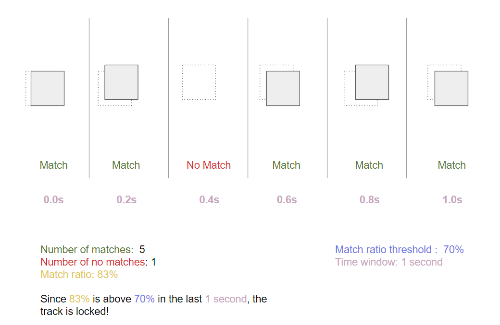
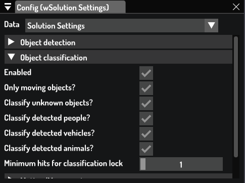
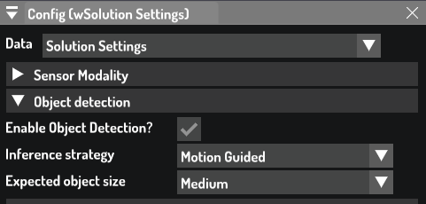
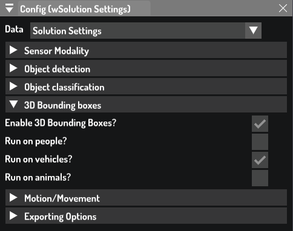

# SecuRT

> WARNING: After cloning the repo, make sure to run `./setup_git_hooks.sh`

This project contains the LUA code-base for the security solution, tailored to use-cases related to perimeter security.

## Features

### Tracking Lock

This project uses a custom heuristic for determining when a track should be locked.

This can be configured under `Tracker/Locking`

Here is an example:

```
"Tracker": {
    "Locking": {
      "match_ratio_threshold": 0.7,
      "time_window_duration_sec": 1.0
    }
  }
```

This is how it works



* `Tracker/Locking/match_ratio_threshold`: The ratio of frames for which a track must be matched within the time window for it to be locked.
* `Tracker/Locking/time_window_duration_sec`: The time window duration to check for locking. A track is only locked if the association match ratio is above the threshold during the time window. This also means that the track will never be locked before it reaches `Tracker/Locking/time_window_duration_sec` seconds of lifetime.

> WARNING: The field `Tracker/min_hits_for_lock is deprecated in this project and won't have any impact on the tracking locking logic

#### Rationale

The default track locking logic relies exclusively on the number of consecutive matches (hits), which can be a problem when dealing with videos with low FPS or with fast moving objects, since we most likely need to tune down the number considering there are less frames to deal with per unit of time. To circumvent these limitations, the new approach relies on the matching quality and time elapsed, which should make the track locking behaviour agnostic to the input framerate.

### Detection & Classification

Each object(track) can be of one of four classes: Unknown, Person, Vehicle, or Animal.

Unknown objects tipically come from motion. If no detection or classification is used, all tracks will belong to the Unknown class.

The Object detector generates detections that can be either Person, Vehicle, or Animal.

The Classifier can classify both motion and detections objects as Person, Vehicle, or Animal. It also contains a Background/Unknown class if it's not sure what a given object is.

#### Classification

Object classification can be configured under `Global/Detection`

Here is an example:

```
"Global": {
        "Classification": {
            "enabled": true,
            "require_locked_track": true,
            "require_moving_track": true,
            "classify_unknowns": true,
            "classify_people": true,
            "classify_vehicles": true,
            "classify_animals": true,
            "min_hits_for_lock": 1,
          }
    }
```

* `Global/Classification/enabled`: Whether to load and run classification at all. Disable to prevent the network from even being loaded. If enabled, will run every frame on all tracks that match the restrictions defined in the other fields
* `Global/Classification/require_locked_track`: Whether to run classification only on locked tracks or not. If set to false, will run on every track which might be slow
* `Global/Classification/require_moving_track`: Whether to run classification only on moving tracks or not.
* `Global/Classification/classify_unknowns`: Whether to run classification on "unknown" objects derived from motion.
* `Global/Classification/classify_people`: Whether to run classification on detections with the "Person" class
* `Global/Classification/classify_vehicles`: Whether to run classification on detections with the "Vehicle" class
* `Global/Classification/classify_animals`: Whether to run classification on detections with the "Animal" class
* `Global/Classification/min_hits_for_lock`: How many consecutive classifications of the same class are needed for it to be attributed to the object. Higher values increase the certainty on the assigned class, but might take longer for it be locked, which might be a problem when dealing with low FPS

This can also be configured in the UI 




The classifier network to be used can be configured through `ClassifierRGB` and `ClassifierThermal` plugin options, depending on the current modality set.


#### Detection

Object classification can be configured under `Global/Detection`

Here is an example:

```
"Global": {
        "Detection": {
            "enabled": true,
            "inference_strategy": "full_frame",
            "max_object_size": "medium"
          }
    }
```

* `Global/Detection/enabled`: Whether to load and run object detection at all. Disable to prevent the network from even being loaded. If enabled, will run detection every frame based on the strategy
* `Global/Detection/inference_strategy`: Inference strategy to use. Can be either `full_frame`, `motion_guided`, or `trigger_shape`. `full_frame` inference feeds the entire frame to the network, `motion_guided` will use motion and movement to define regions where to look for objects, while `trigger_shape` runs inference on the shape of the trigger. `full_frame` is ideal when there is enough compute to use heavier detectors, while `motion_guided` is recommended for lightweight devices.
* `Global/Detection/max_object_size`: Only relevant if `strategy` is set to `motion_guided`. Defines the size of the detector region as a percentage of the image size. Possible values are `tiny`, `small`, `medium`, `large`, and `xlarge`. Each tripwire/zone will produce its own detection region

> It's important to note that `max_object_size` can be overwritten by a given tripwire/zone.
For instance, the following zone will use a small detection region regardless of `Global/Detection/max_object_size`: `"Zone": {"70f5570b-920a-4f61-abed-ac05380ba6d3": { "max_object_size": "small"}}`

This can also be configured in the UI 



### 3D bounding boxes

The use of 3d bounding boxes allows a more precise location of the object in 3d space through 8 points.

The model to be used can be configured in `Bbox3d/model_file`.

The heuristics related to 3d bounding boxes can be configured under `Global/Bbox3d`. Here is an example

```
"Global": {
  "Bbox3d": {
        "enabled": false,
        "run_on_people": false,
        "run_on_vehicles": true,
        "run_on_animals": false,
        "run_on_unknowns": false
      }
}
```
* `Global/Bbox3d/enabled`: Whether to load and run 3d bounding box regression at all. Disable to prevent the network from even being loaded. If enabled, will run the network on every valid track every frame.
* `Global/Bbox3d/run_on_people`: Whether to generate 3d bounding boxes for people.
* `Global/Bbox3d/run_on_vehicles`: Whether to generate 3d bounding boxes for vehicles.
* `Global/Bbox3d/run_on_animals`: Whether to generate 3d bounding boxes for animals.

This can also be configure in the UI



