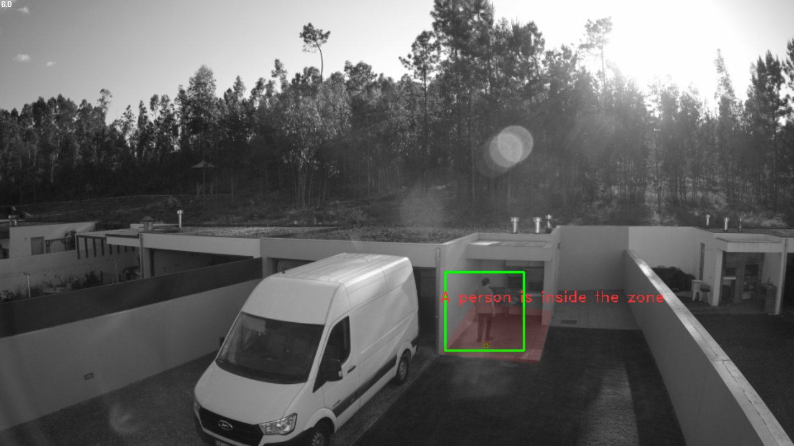
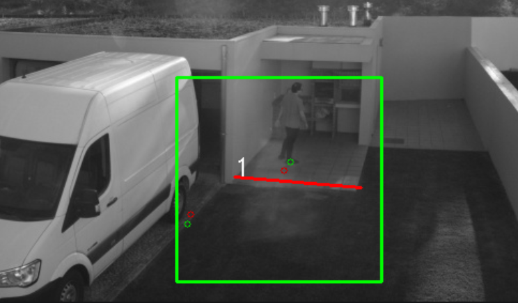
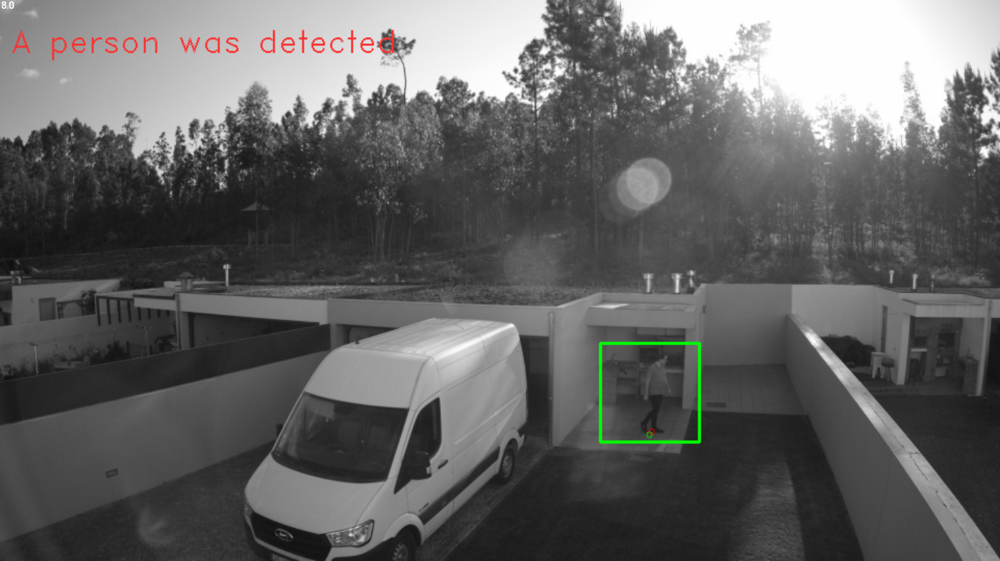
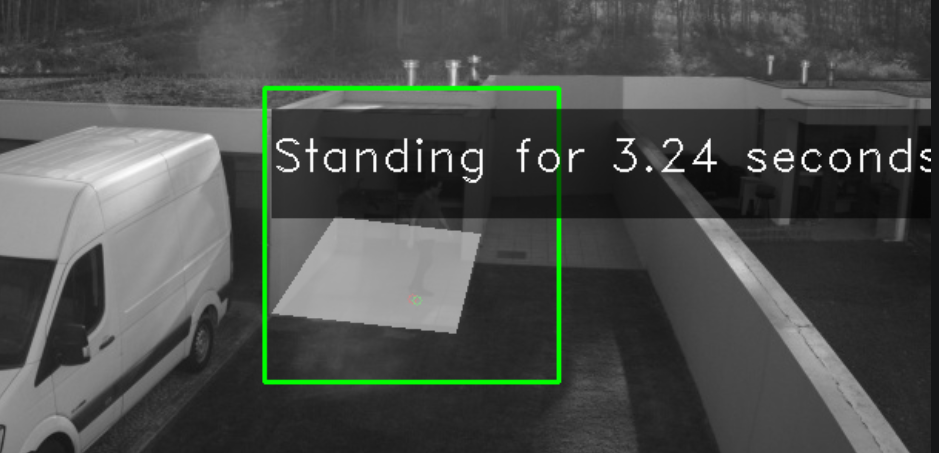
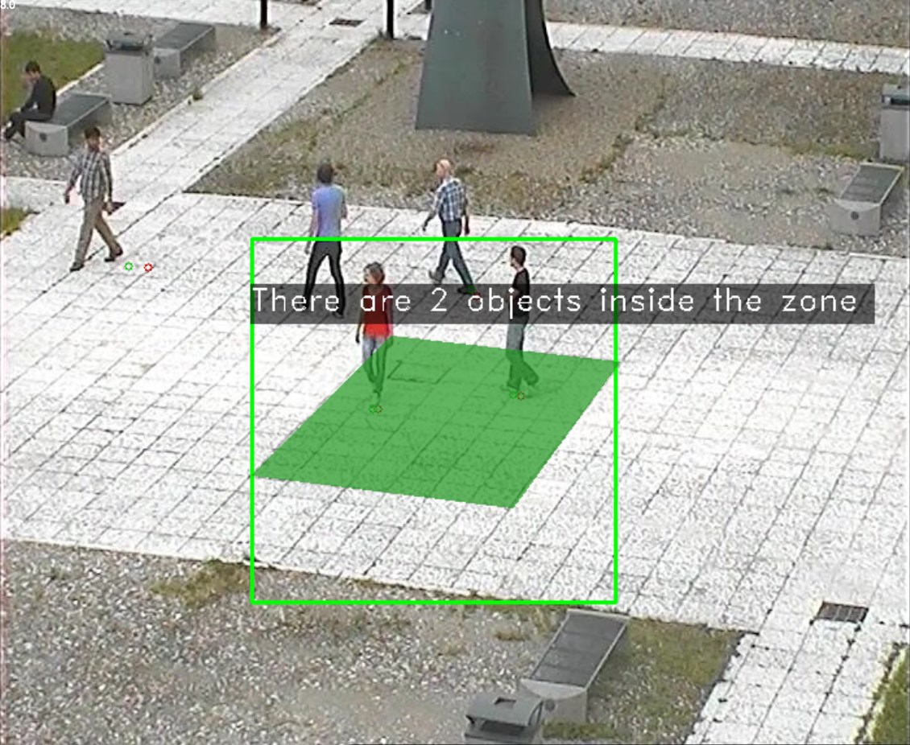
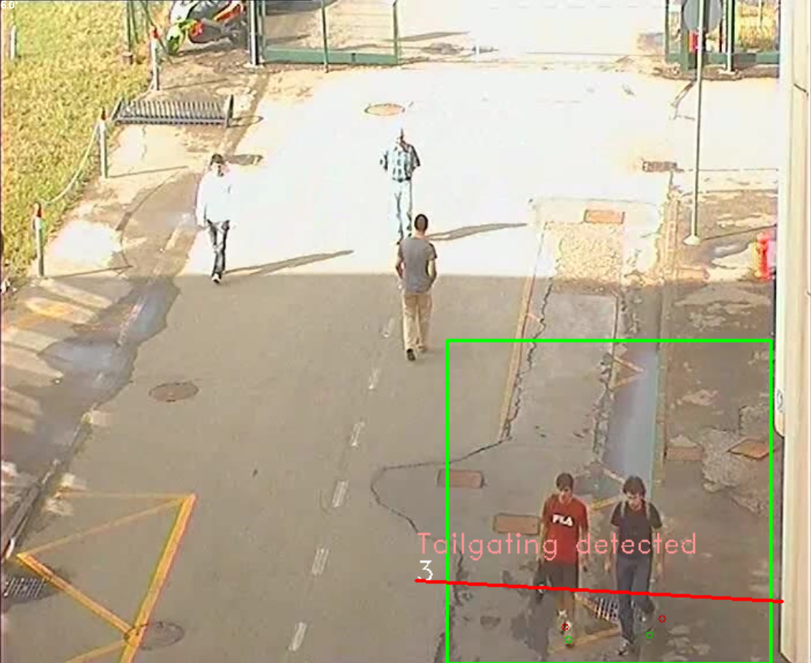
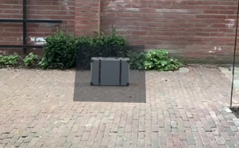
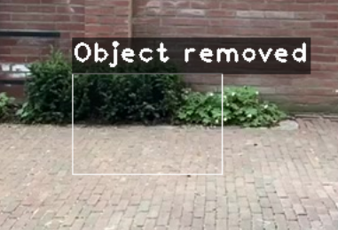

# Capabilities

This document describes the capabilities supported by this solution and their settings

## Common settings

All capabilities rely on tripwires and zones. A tripwire is a line between two points, and a zone is defined by a polygon with three or more points.

In addition to the basic settings, this solution supports the following two fields for each tripwire/zone:

- `object_size`: What is the expected object size to be detected? This will determine the size of attentation area where objects will be searched. If the attention area is too big, then we will fail to detect small objects, and if it is too small, then we might detect only parts of an entire object. This can be set to one of the following values:
    - `tiny` : 10% of the image width
    - `small`: 20% of the image width
    - `medium`: 30% of the image width
    - `large`: 40% of the image width
    - `xlarge`: 60% of the image width
    - `xxlarge`: 70% of the image width

- `class_filter`: We might want our tripwire/zone to only consider either vehicles or person. If not set, it will consider both. This can be set to one of the following values:
    - `vehicle` : Only consider vehicles
    - `person` : Only consider person


## Area occupancy

To be notified when an object enters an area, you just need to set up a zone with type `area_detection` and set area_type to `occupancy` (in addition to the common `object_size` and `class_filter` fields described above) as demonstrated in the example below. 

```
"Zones": {
   "zones": [
    {
    "class_filter": "person",
    "max_object_size":"tiny",
     "name": "1",
     "shape": [
      [
       573.4351196289063,
       365.1864318847656
      ],
      [
       666.8702392578125,
       376.16949462890625
      ],
      [
       651.2977294921875,
       440.2372741699219
      ],
      [
       532.2137451171875,
       426.50848388671875
      ]
     ],
     "type": "area_detection",
     "type": "occupancy",
     "zoneid": 1.0
    }
   ]
 }
```

An event is triggered when an object enters the area and a message will be displayed next to it in the visualization output



## Line crossing

Setting up a line crossing capability is easy. You just need to have a tripwire configured with the `object_size` and `class_filter` fields defined as described above. Please check the instance configuration `person_line_crossing.json` for an example.

Each time an object crosses the line, its counter will increase. You can see the number of times a line has been crossed next to it in the visualization output




## Object intrusion

This capability will trigger an event every time a relevant object (person or vehicle) is detected in the image.

To set it up, you need to set a full-screen zone with the `type` set to `area_detection` and `area_type` set to `intrusion`. Here is an example of how it looks like in the _json_ file for a 960x540 video

```
"Zones": {
   "zones": [
    {
     "class_filter": "person",
     "max_object_size": "tiny",
     "cooldown": 4.0,
     "name": "1",
     "shape": [
      [0,0],
      [960,0],
      [960,540],
      [0,540]
     ],
     "type": "area_detection",
     "area_type": "intrusion",
     "zoneid": 1.0
    }
   ]
 }
```

In addition to the `class_filter` and `object_size` fields, an intrusion zone has a `cooldown` field that determines how long it waits (in seconds) before triggering an event for a given object. This was introduced to avoid trigering immediately when a person entered the frame, which would prevent us from seeing the entire body.

When a relevant object is detected, a message will be rendered in the top-left section of the visualization output



## Object loitering in area

Detecting object loitering can be achieved by setting up a zone with type set to `loitering` as demonstrated in the following example

```
"Zones": {
   "zones": [
    {
    "class_filter": "person",
    "max_object_size":"small",
     "name": "1",
     "shape": [
      [
       573.4351196289063,
       365.1864318847656
      ],
      [
       666.8702392578125,
       376.16949462890625
      ],
      [
       651.2977294921875,
       440.2372741699219
      ],
      [
       532.2137451171875,
       426.50848388671875
      ]
     ],
     "type": "loitering",
     "loitering_min_duration": 3.0,
     "zoneid": 1.0
    }
   ]
 }
```

In addition to the `class_filter` and `object_size` fields, a loitering area supports the `loitering_min_duration` field which specifies how long an object needs to be inside that area to be considered as loitering (in seconds).

When loitering is detected (as in, when an object stays within an area for more than `loitering_min_duration` seconds), a message will be displayed next to the zone indicating how long the object has been standing inside the zone.





## Area Counting (Crowding)

Object crowding will trigger once the number of objects in a zone exceeds a certain threshold. To activate object crowding set the type of a zone to `area_counting` as demonstrated in the example below

```
"Zones": {
   "zones": [
    {
     "crowding_min_count": 1.0,
     "name": "1",
     "class_filter": "person",
     "max_object_size": "large",
     "shape": [
      [
       302.0567626953125,
       260.43829345703125
      ],
      [
       477.85699462890625,
       279.6116638183594
      ],
      [
       395.5505065917969,
       392.25518798828125
      ],
      [
       194.9784393310547,
       367.4895935058594
      ]
     ],
     "type": "area_counting",
     "zoneid": 1.0
    }
   ]
 }
```

In addition to the `class_filter` and `object_size` fields, a crowding zone supports the `crowding_min_count` field which specifies the count threshold for triggering.

Once the number of objects in a zone passes the threshold number defined by `crowding_min_count`, a message will be rendered next to the zone with the number of objects in it.



## Object tailgating

When a tripwire is configured to detect tailgating, it will trigger every time two objects cross it in quick succession. This can be achieved by setting the tripwire type to `tailgating`, as demonstrated in the example below

```
"Tripwires": {
   "tripwires": [
    {
     "class_filter": "person",
     "max_object_size": "large",
     "dir1": [
      [
       [
        518.0,
        517.0
       ],
       [
        517.0,
        537.0
       ]
      ]
     ],
     "dir2": [
      [
       [
        519.0,
        507.0
       ],
       [
        520.0,
        487.0
       ]
      ]
     ],
     "direction": "Both",
     "name": "1",
     "shape": [
      [
       360.3735656738281,
       503.4574890136719
      ],
      [
       676.7083740234375,
       520.8180541992188
      ]
     ],
     "tailgating_max_duration": 1.0,
     "type": "tailgating",
     "wireid": 1.0
    }
   ]
 }
```


In addition to the `class_filter` and `object_size` fields, a tailgating tripwire supports the `tailgating_max_duration` field which specifies the maximum time allowed (in seconds) between two object crossings for it to be considered tailgating.

If tailgating is detected, a message will be displayed next to the tripwire for two seconds in the visualization output



## Object Removed

Object Removed will trigger when a significant scene change occurs in a given region. The region should be defined around the object of interest. For this to work, a zone with type `object_removed` should be used, as shown below

```
"Zones": {
   "zones": [
    {
     "color": [
      38.0,
      44.0,
      51.0,
      1.0
     ],
     "name": "1",
     "object_removed_duration": 5.0,
     "shape": [
      [
       320.18878173828125,
       270.0
      ],
      [
       425.250732421875,
       268.75
      ],
      [
       427.752197265625,
       360.0
      ],
      [
       312.6843566894531,
       357.5
      ]
     ],
     "type": "object_removed",
     "zoneid": 1.0
    }
   ]
 }
```



Note how there is no field for `object_size` or `class_filter`, but there is a field `object_removed_duration` which determines how long, in seconds, an object must be absent in order to be considered as removed. When a object is removed, a message will be displayed in the area of the detection




## Object Left

Object Left will trigger when a significant scene change occurs in a given region. The region shall be defined. For this to work, a zone with type `object_left` should be used, as shown below.

```
"Zones": {
   "zones": [
    {
     "color": [
      38.0,
      44.0,
      51.0,
      1.0
     ],
     "name": "1",
     "object_left_duration": 5.0,
     "shape": [
      [
       320.18878173828125,
       270.0
      ],
      [
       425.250732421875,
       268.75
      ],
      [
       427.752197265625,
       360.0
      ],
      [
       312.6843566894531,
       357.5
      ]
     ],
     "type": "object_left",
     "zoneid": 1.0
    }
   ]
 }
```
