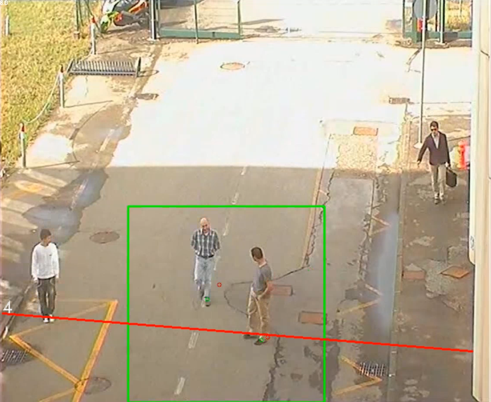
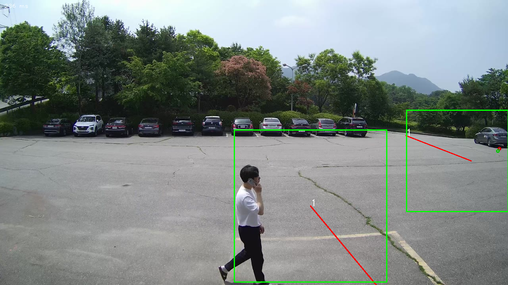

# Limitations

This document describes the limitations on the available capabilities for different devices

## 2008b (S5L)

### Big areas for person crowding
 

The solution on the S5 relies on object detector networks, and thus requires a minimum number of Pixels on Target for a person to be properly detected. This is problematic for person counting applications when dealing with large areas. The problem is exacerbated when operating under difficult conditions (low visibility, night, etc). This can be solved in CV2x by creating more “attention areas” since the processor is fast enough to run multiple inference passes.

### Multiple tripwire crossings on large segments
 

This image shows a potential issue when dealing with large tripwires where multiple people are crossing at different ends of the segment. The detection area (the green box) might not be big enough to cover the entire tripwire length and might thus miss some object crossings. If it were enlarged, it might start missing some objects due to their Pixels on Target. This can be solved in CV2x by creating more “attention areas” since the processor is fast enough to run multiple inference passes.

### Multiple tripwires with concurrent motion

When dealing with multiple tripwires in a busy scene, the system needs to run the object detector multiple times which is slow, and that might prevent us from getting enough frames to confidently detect that something is a vehicle/person, leading to unexpected results, such as a tripwire not being triggered when and object crosses it.

## 2002b (S3L)

In addition to the limitations presented above, the 2002b poses additional challenges due to the high latency in running neural networks. Our solutions run at ~650ms latency, which means we can achieve, at most, 2 FPS when the object detector is running.

### Fast-moving objects

Considering the latency described above, fast-moving objects become problematic on the S3L. If an object moves more than its size between frames (where each frame is 650ms apart from the previous one), we struggle to track it. This affects all capabilities. 

### Multiple tripwires or zones

This high latency makes it even more difficult to deal with multiple tripwire/zones, since each one would require an object detector pass, which would compound the problem